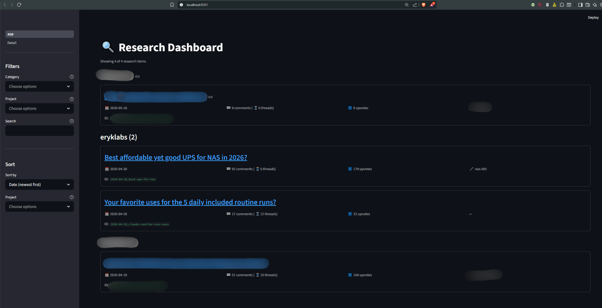
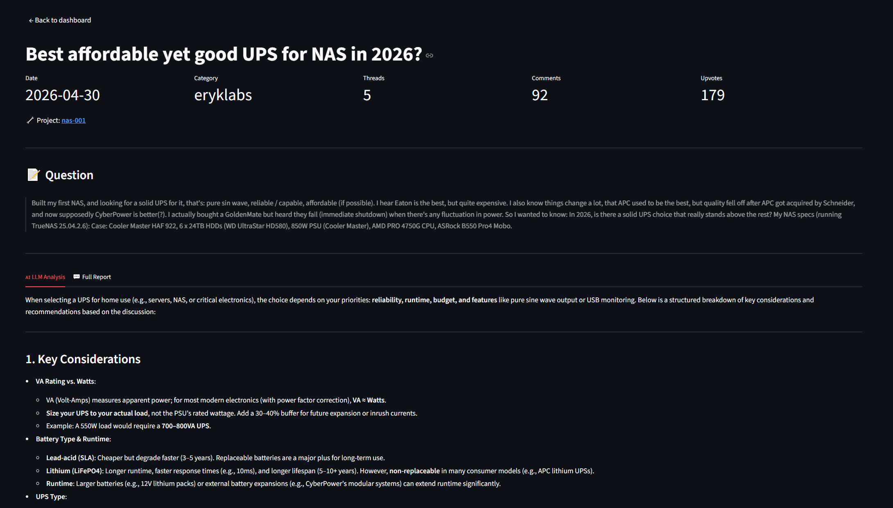
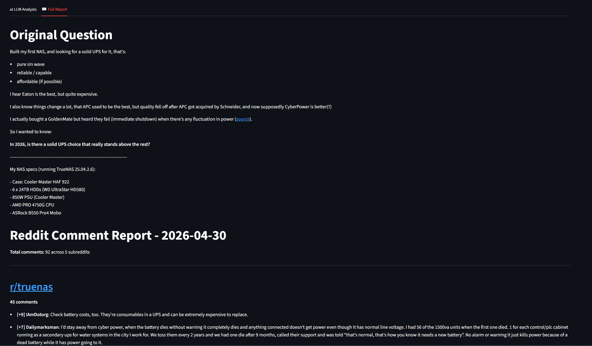
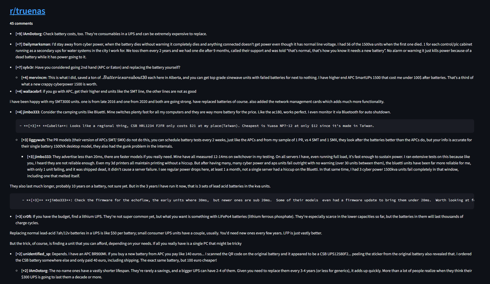

# Research Dashboard

I post research questions across multiple subreddits - things like "best UPS for a NAS" or "advice for shipping product X internationally" - then scrape the answers and run them through a local LLM to synthesize what people actually agreed on, what got buried but mattered, and what to actually do. Over time this produced a folder of markdown reports and JSON files that became impossible to navigate. I built this dashboard to solve that.

It's the **read layer** of a two-part personal data pipeline. A separate aggregator project handles ingestion (scraping, LLM analysis, file output). This project handles surfacing: a multi-page Streamlit app reads the file outputs, joins metadata from a per-research `meta.json`, and exposes everything through filterable lists, sortable columns, and per-item detail views.


**What this project demonstrates:**

- **Multi-stage data pipeline design.** Ingestion and presentation are decoupled - they share a documented JSON schema (`meta.json`) but neither knows about the other's internals. The dashboard could swap to a different aggregator (Other specialized forums, YouTube transcripts) without code changes, only schema mapping.
- **Pandas as the data boundary.** A single `data.py` module reads files from disk and returns a DataFrame. The Streamlit pages never touch the filesystem. If I switched to SQLite tomorrow, only one file would change.
- **Streamlit multi-page architecture** with URL-parameter-based navigation between the home view and per-item detail views.
- **Schema design with explicit versioning** (`schema_version: 1` in `meta.json`) so future schema changes can be migrated rather than break the dashboard.
- **Honest scoping.** The README documents what works, what doesn't, and what's deliberately deferred. The aggregator refactor is listed as a known limitation - I shipped the read layer first because it's the part I'd use daily.

**Status:** MVP. Single-source (Reddit) today, designed to extend to other specialized forums and YouTube transcripts next. Used personally to track ongoing research across ~9 topic categories.

## Screenshots



<span style="color: #00ff7f">*Home page: research items grouped by category, with filtering and sorting in the sidebar.* </span>

<br/>

---



*<span style="color: #00ff7f">Detail page: metadata cards, original question, and tabbed view of LLM analysis and full Reddit comment report.</span>*

<br/>

---



*<span style="color: #00ff7f">Detail page: original question.</span>*

<br/>

---



*<span style="color: #00ff7f">Detail page: example of all responses, organized and sorted for readability.</span>*

<br/>

---


## Why this exists

I post research questions across multiple subreddits, scrape the comments, and run them through a local LLM for analysis. Output is a folder of markdown and JSON files. Without a UI, finding past research means digging through folders by date and slug. This dashboard solves that.

The design intent is also to extend beyond Reddit later - same dashboard pattern, additional sources (YouTube transcripts, voice notes, etc.). Hence the generic name `research-dashboard` rather than `reddit-dashboard`.

## What it does today

- Reads research items from a folder of dated subfolders (one folder per research run)
- Lists all research items on a home page, grouped by category
- Filters by category, project, free-text search across title and question
- Sorts by date, title, threads, comments, upvotes
- Detail page per research item showing question, LLM analysis, and full report
- Clean separation: research data lives outside the project folder; dashboard is read-only

## Architecture

```
┌─────────────────────────────────┐
│ Reddit aggregator (separate)    │
│ - scrape.py + analyze.py        │
│ - Outputs to research-data/     │
└──────────────┬──────────────────┘
               │
               ▼
┌─────────────────────────────────────────────────┐
│ ~/research-data/reddit/                         │
│                                                 │
│ <YYYY-MM-DD>_<topic-slug>/                      │
│   ├── meta.json     ← canonical metadata        │
│   ├── scan.json     ← raw scraped data          │
│   ├── report.md     ← formatted comment report  │
│   └── analysis.txt  ← LLM analysis              │
│                                                 │
│ (one folder per research run)                   │
└──────────────┬──────────────────────────────────┘
               │
               ▼
┌─────────────────────────────────────────────────┐
│ Streamlit dashboard (this project)              │
│                                                 │
│ ┌──────────┐  ┌──────────────┐  ┌────────────┐  │
│ │config.py │→ │  data.py     │→ │  app.py    │  │
│ │ (paths,  │  │ (loads files,│  │ (home page,│  │
│ │  consts) │  │  returns DF) │  │  filters)  │  │
│ └──────────┘  └──────────────┘  └────────────┘  │
│                       │                         │
│                       ▼                         │
│                ┌─────────────────┐              │
│                │ pages/1_Detail  │              │
│                │  (per-item view)│              │
│                └─────────────────┘              │
└─────────────────────────────────────────────────┘
```

### Data flow

1. **Reddit aggregator** (separate project) scrapes Reddit, runs LLM analysis, writes 4 files per research run to `~/research-data/reddit/<date>_<slug>/`.
2. **`data.py`** walks that folder on every page load, reads each `meta.json` + `scan.json` + `report.md` + `analysis.txt`, and returns a Pandas DataFrame. Cached with `@st.cache_data` so repeated calls don't re-read every file.
3. **`app.py`** displays the DataFrame as a filterable list grouped by category. Clicking a research item navigates to the detail page with the item's ID in the URL.
4. **`pages/1_Detail.py`** reads the ID from the URL, finds the matching row in the DataFrame, renders the full content with metadata cards and tabbed report/analysis.

### Why this architecture

- **Data outside code.** The research data lives outside this repo. Code repo is portable; data backups happen separately. Gitignoring data is automatic because it's not in the project folder.
- **Read-only dashboard.** This project never writes to research files. The aggregator owns the data lifecycle. Decoupling means I can swap aggregators or sources later without touching the dashboard's read logic.
- **Pandas as the boundary.** `data.py` is the only file that knows about JSON or filesystem. Everything else operates on DataFrames. If I ever switch to a database, only `data.py` changes.
- **Streamlit's multi-page convention.** The `pages/` folder is auto-discovered. Adding a new page = adding a file. URL navigation between pages is via query parameters.

## Project structure

```
research-dashboard/
├── README.md           ← this file
├── requirements.txt
├── .gitignore
├── app.py              ← Streamlit entry point (home page)
├── lib/
│   ├── __init__.py
│   ├── config.py       ← paths, categories, sort options
│   └── data.py         ← file reading + DataFrame construction
├── pages/
│   └── 1_Detail.py     ← detail page (clicked from home)
├── notes.md            ← future-tasks list (gitignored if personal)
└── .venv/              ← virtual environment (gitignored)
```

## meta.json schema

The canonical metadata file in each research folder. The aggregator writes this; the dashboard reads it.

```json
{
  "schema_version": 1,
  "id": "<YYYY-MM-DD>_<topic-slug>",
  "created_at": "<ISO-8601 datetime>",
  "topic_slug": "<topic-slug>",
  "title": "<human-readable title>",
  "category": "<one of the configured categories>",
  "question": "<original question text>",
  "source": {
    "subreddit_urls": [],
    "threads_scraped": 0,
    "first_scraped_at": "<ISO-8601 datetime>",
    "last_scraped_at": "<ISO-8601 datetime>"
  },
  "metrics": {
    "total_comments": 0,
    "total_upvotes": 0,
    "distinct_subreddits": 0,
    "latest_thread_activity": null,
    "analyzed_at": "<ISO-8601 datetime>",
    "previous_total_comments": null,
    "previous_total_upvotes": null
  },
  "user": {
    "notes": "",
    "obsidian_link": null,
    "blog_post_status": "none",
    "project": null,
    "custom_tags": []
  }
}
```

Field roles:

- **Identity** (`id`, `created_at`, `topic_slug`): set once, never change. `id` matches folder name.
- **Classification** (`category`, `title`, `question`): set when research is created. `category` is enforced from a fixed list in `config.py`. `title` is human-readable for the dashboard list. `question` is the original question text.
- **Source** (subreddit URLs, scrape timestamps): metadata about where the data came from.
- **Metrics**: aggregated counts and timestamps.
- **User**: personal annotations. `project` for cross-research tagging (e.g., a homelab build identifier), `custom_tags` for ad-hoc tagging.

## Categories

Defined in `lib/config.py` as a flat list of strings. The list is application-specific - modify it to fit your own research domains. Adding a new category means adding a string to the list. Categories are enforced at ingestion time (the aggregator validates against the list), so misspellings and typos can't sneak in.

Example categories you might use:

- `tech` - programming, infrastructure, tools
- `home` - appliances, repairs, durable goods to buy
- `health` - fitness, sleep, nutrition, supplements
- `finance` - personal finance, investing, taxes
- `career` - interview prep, salary research, role transitions
- `travel` - destinations, logistics, gear
- `learning` - courses, books, skill-building
- `parenting` - childcare, education choices
- `vehicles` - car research, maintenance
- `best_of` - "what's the best X" research that doesn't fit elsewhere

Pick categories that match how *you* think about your research, not how someone else organizes theirs. The right number is roughly 6–12 - fewer makes them too coarse to filter usefully, more makes the dropdown unwieldy and creates ambiguity at tagging time.

## Setup

```powershell
cd research-dashboard

python -m venv .venv
.venv\Scripts\activate     # Windows PowerShell
# source .venv/bin/activate  # Linux/Mac

pip install -r requirements.txt
```

Edit `lib/config.py` to set `RESEARCH_PATH` to your research data folder.

## Running

```powershell
streamlit run app.py
```

Browser opens to `http://localhost:8501`. Stop with `Ctrl+C`.

## How to use

**Home page:**
- Sidebar has filters (category, project, search) and sort dropdown
- Main area shows research items grouped by category
- Click any title to open the detail view

**Detail page:**
- Metadata cards at top (date, category, threads, comments, upvotes)
- Project tag if set
- Question text
- Tabbed view: LLM Analysis (the synthesized takeaways) and Full Report (raw comments)
- Back link returns to home

## Adding new research

The dashboard reads what's already in the research folder. To add new research:

1. Run the Reddit aggregator on a new question
2. Aggregator writes 4 files to a new dated subfolder
3. Refresh the dashboard - it picks up the new folder automatically

Currently the aggregator still uses an older flat-file output format. Pending refactor (see future tasks).

## Known limitations

- **Aggregator hasn't been refactored yet.** Existing research items were migrated manually. New research from the old scraper produces flat files (not the new folder structure) and would need manual migration. Planned: refactor the aggregator to write the new structure directly.
- **Question display flattens markdown formatting.** Newlines and bold get squashed during JSON storage. Source-of-truth formatting is preserved in `report.md` but not in the dashboard's "Question" section.
- **Full report has formatting glitches.** Nested comment indentation triggers markdown code blocks. Bug is in the aggregator (`analyze.py`), not the dashboard.
- **`latest_thread_activity` is always null.** Computing it requires `created_utc` from Reddit's response, which the aggregator doesn't currently capture.
- **No write capability.** The dashboard reads only. Annotating research from the dashboard (notes, marking items "done") is not implemented.
- **Local only.** Runs on localhost. Not deployed to a server.

## Future tasks

See `notes.md` for the working list. High-priority categories:

**Aggregator refactor:**
- CLI args for topic/title/category/question (replace hardcoded constants)
- Write `meta.json` per research run
- Use new folder structure
- Capture `created_utc` for posts and comments
- Fix nested comment indentation in markdown report
- Add total upvotes line to report header

**Dashboard enhancements:**
- Clickable project tag → home page filtered by that project
- Action item capture (write to external notes inbox) - only after enough real use confirms the friction is real
- Better question rendering (preserve markdown formatting)

**Eventual:**
- Deploy to a server
- Add second source (YouTube transcripts) using same pattern
- Cross-source view if/when multiple sources are integrated

## Tech stack

- Python 3.12+
- Streamlit - multi-page app framework
- Pandas - DataFrame as the data boundary

## License

Personal project. No license assigned.
